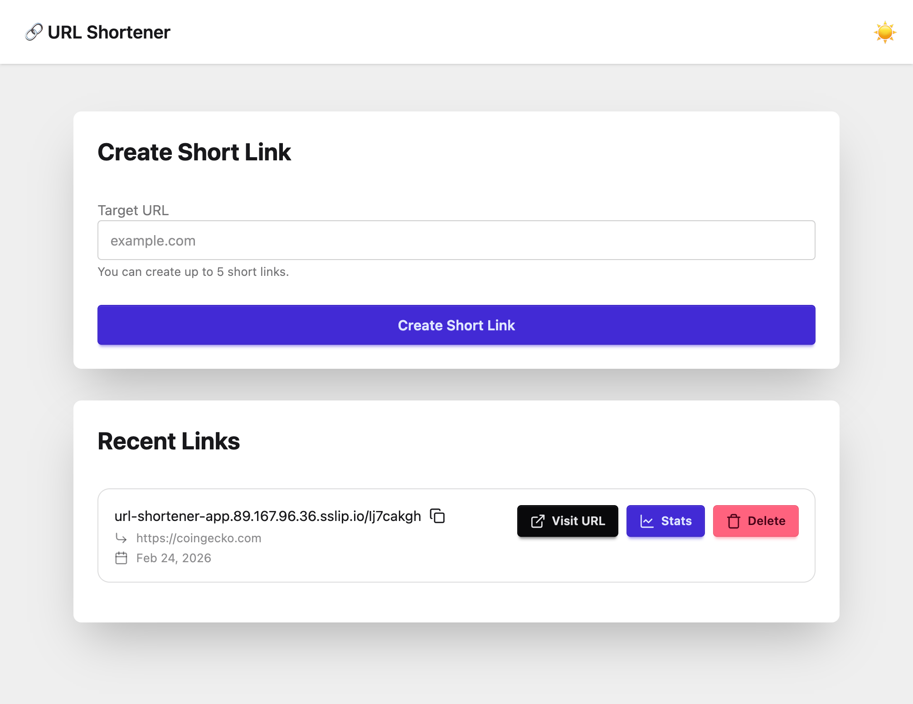
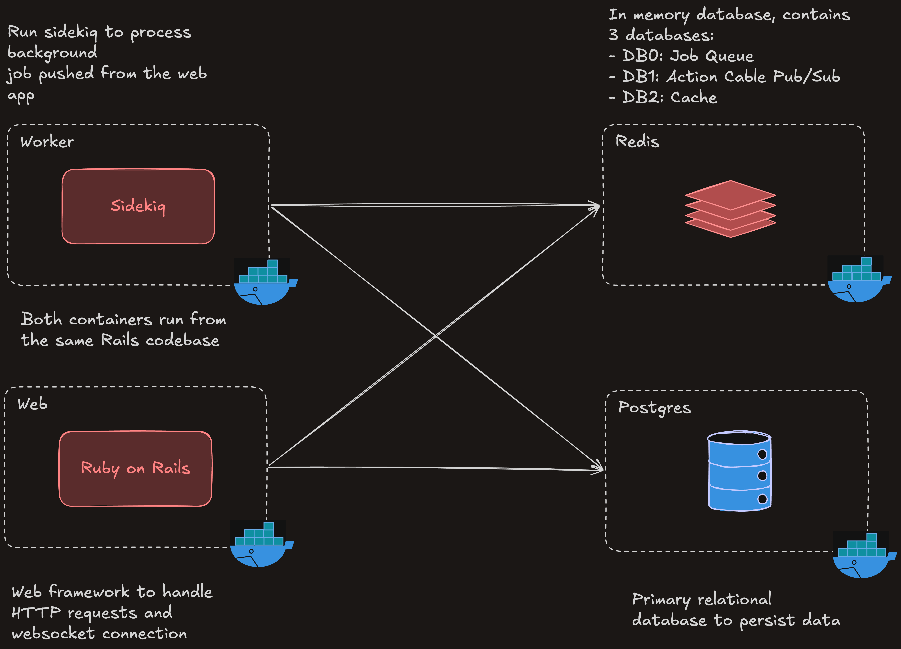

# 🔗 URL Shortener - CoinGecko Engineering Written Assignment

> **Note:**
> 2nd part of the assignment is in the `extensions/submission` folder. Please refer to the [submission folder](./extensions/submission) for more information.

Live: https://url-shortener-app.89.167.96.36.sslip.io/



A simple, URL Shortener service built as part of the CoinGecko Engineering Written Assignment.

## ⭐ Features

- Shorten URLs with unique short codes
- Track visits with metadata (timestamp, IP, geolocation)
- Paginated visit history for each short URL
- Background processing for metadata fetching and geolocation
- Real-time updates on visit counts and recent activity
- Mobile responsiveness and dark mode

## 🛠 Tech Stack

### Framework & Libraries

- Ruby on Rails — Web framework and MVC architecture
- PostgreSQL — Primary relational database
- Redis — Caching, Sidekiq, and Action Cable adapter
- Sidekiq — Background job processing for metadata fetching and geolocation
- RSpec — Testing framework
- Tailwind CSS + DaisyUI — Utility-first styling and UI components

### DevOps / Infrastructure

- Docker — Containerized development and deployment
- Dokku — Self-hosted PaaS deployment platform

## 🏗 Architecture

### High-Level Overview



- Web and Worker are two separate containers from the same Dokku app, sharing the same Redis and Postgres instances.
- Web handles HTTP requests, Worker handles background jobs.
- Both connect to Redis and Postgres, hence the crossing arrows.

For more in-depth information, please refer to the [strategies used](#-strategies-used) and [deployment guide](./docs/deployment.md) document.

## 🚀 Getting Started

### Prerequisites

- Ruby 3.4.8+
- PostgreSQL 16.2+
- Redis 7.2.4+
- Docker & Docker Compose (Optional, for containerized postgres and redis instances)

> **Note:**
> For local development, you can either set up PostgreSQL and Redis manually or use Docker Compose with the provided `docker-compose.dev.yml` file.

### Installation Steps

1. **Clone the Repository**

   ```bash
   git clone https://github.com/kyleong/url-shortener.git
   cd url-shortener
   ```

2. **Set Up Environment Variables**

   Create a `.env` file in the root directory based on the `.env.example`

   ```bash
   cp .env.example .env
   ```

   Fill in the required values in the `.env` file.

   > **Tips:**
   > If using Docker, you can use the same credentials as defined in the `.env.example` file and change the `DB_PASSWORD` and `REDIS_PASSWORD`.
   >
   > For local development, ensure your PostgreSQL and Redis instances are running and accessible with the credentials you provide.

3. **Set Up Docker (Optional)**

   If you prefer using Docker, start the postgres and redis services with:

   ```bash
   docker-compose -f docker-compose.dev.yml up -d
   ```

   This will start PostgreSQL and Redis containers with the configurations specified in the `docker-compose.dev.yml` file.

   > **Note:**
   > Skip this step if you have PostgreSQL and Redis set up locally.

4. **Install Dependencies**

   ```bash
   bundle install
   ```

5. **Set Up the Database**

   ```bash
   rails db:create
   rails db:migrate
   ```

6. **Start the Application**

   ```bash
   bin/dev
   ```

   This will start both the Rails server and Sidekiq worker concurrently.

7. **Access the Application**

   Open your browser and navigate to `http://localhost:3000` to see the URL Shortener in action!

## 🧪 Running Tests

Before running tests, ensure the test database is set up:

```bash
rails db:test:prepare
```

To run the test suite, execute:

```bash
bundle exec rspec
```

This will generate a test coverage report in the `coverage/` directory. Open `coverage/index.html` in your browser to view the detailed coverage report.

## 🎯 Strategies used

Please refer to the [strategies used](./docs/strategy.md) for more information.

## 🚀 Deployment

Please refer to the [deployment guide](./docs/deployment.md) for more information.

## Folder Structure

Folder structures follows the standard Rails folder structure.

Below are the key directories and their roles used which are crucial for this assignment.

```
app/
├── controllers/        # MVC controllers
├── models/             # MVC models
├── views/              # ERB templates
├── javascripts/        # JavaScript files for Turbo and Stimulus
├── jobs/               # Sidekiq background jobs
├── lib/                # Custom libraries
├── queries/            # Query objects
├── services/           # Service objects
└── helpers/            # View helpers

config/
├── routes.rb           # Application routes
├── application.rb      # Main application
├── cable.yml           # Action Cable configuration
├── cache.yml           # Cache configuration
├── database.yml        # Database configuration
├── sidekiq.yml         # Sidekiq configuration
├── environments/       # Environment-specific configs
└── initializers/       # Application initializers

db/
├── migrate/            # Database migrations
└── schema.rb           # Database schema

spec/                   # RSpec test files
├── controllers/        # Controller tests
├── factories/          # FactoryBot factories
├── helpers/            # Helper tests
├── jobs/               # Job tests
├── lib/                # Lib tests
├── models/             # Model tests
├── queries/            # Query tests
└── services/           # Service tests

public/                 # Publicly accessible assets

extensions/submission/  # Submission for extension 1

docker-compose.dev.yml  # Docker Compose file for local development
Dockerfile              # Dockerfile for building the application image in production
.env.example            # Environment variables example
Gemfile                 # Gemfile
Gemfile.lock            # Gemfile.lock
Procfile.dev            # Process file for local development
Procfile                # Process file for production
```

## ⚠️ Assumptions

- Public service with no authentication and no user accounts.
- Single instance deployment (no horizontal scaling, but designed to be horizontally scalable).
- IPv4 geolocation sufficient.
- Rate limiting and only allow 5 URL shortening requests per session (browser).
- No malicious content filtering implemented (user can shorten any URL, including potentially harmful ones).
- No staging environment or CI/CD pipeline set up for this assignment.
