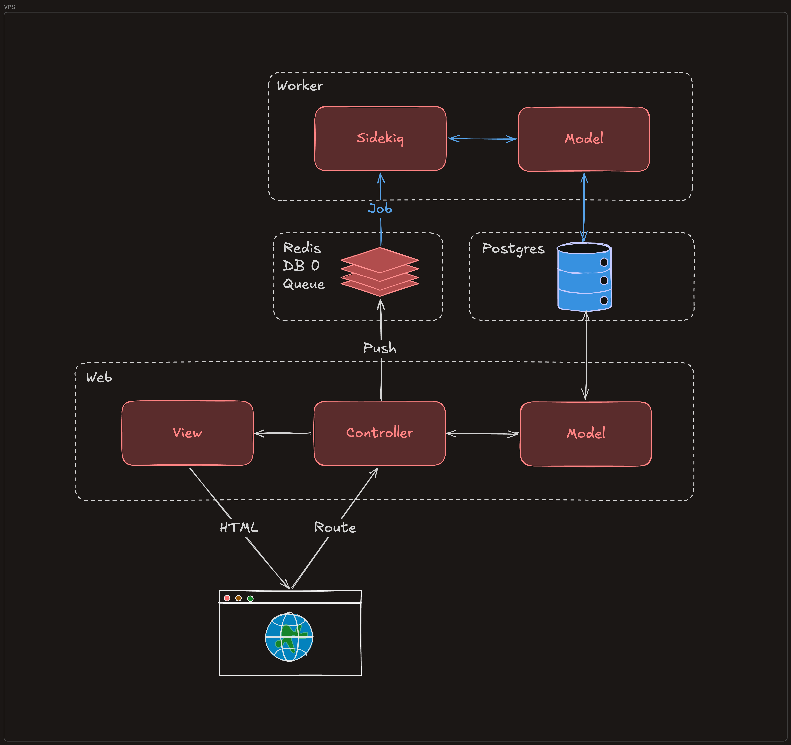
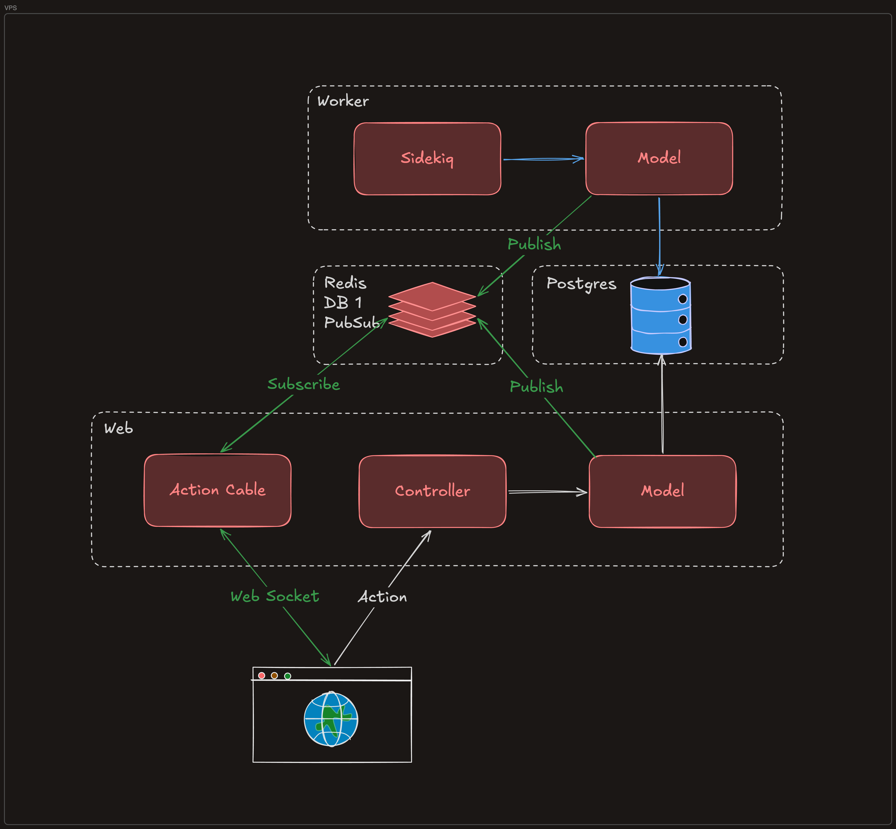
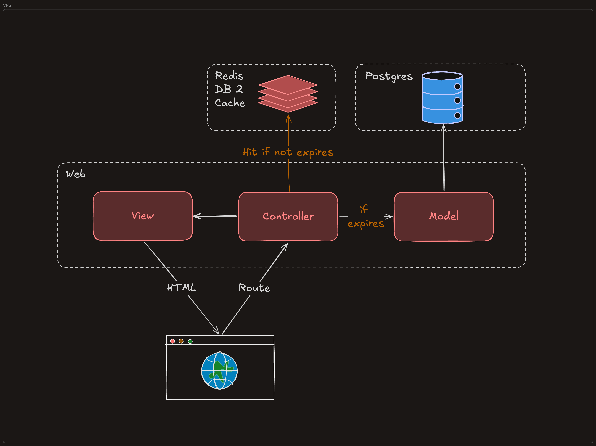
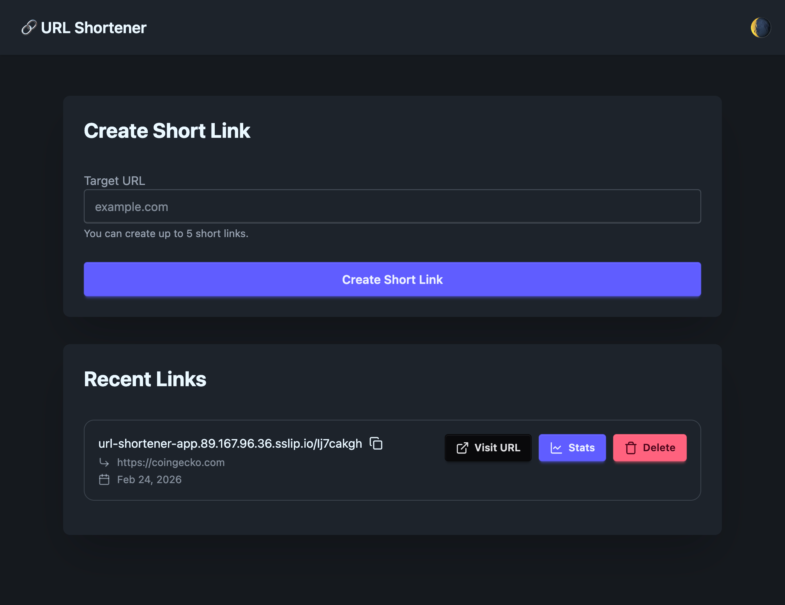
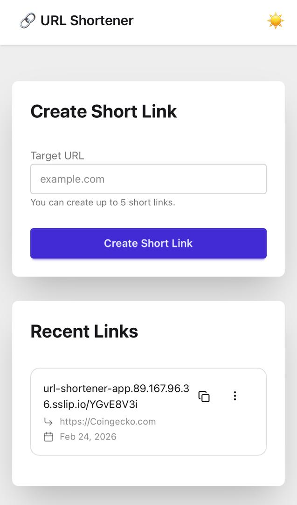

# 🔗 URL Shortener - CoinGecko Engineering Written Assignment

This document will outline the strategies and design decisions that have made while developing the URL Shortener service.

## 🔗 URL Shortening

The URL shortening process produces short code which is made of two parts joined together:

```
[Random Prefix (7 chars)] + [Base62 Encoded ID]
```

### Random Prefix (7 chars)

This 7 character random prefix is sampled from the Base62 character set (`a-zA-Z0-9`).

The random prefix serves two purposes:
1. **Obfuscation**: It makes the short URL **less predictable and more resistant to brute-force attacks**.
2. **Uniqueness**: It adds an uniquness, **reducing the likelihood of collisions** when multiple URLs are shortened in a short period of time.

### Base62 Encoded ID

This numeric ID is generated from the database record's primary key (ID) and encoded into a Base62 string, making the short code compact and URL-friendly.

| ID Range | Base62 Length | Example |
|---|---|---|
| 0 | 1 char | `0` |
| 1 – 61 | 1 char | `1`, `Z` |
| 62 – 3,843 | 2 chars | `10`, `ZZ` |
| 3,844 – 238,327 | 3 chars | `100` |
| 238,328 – 14,776,335 | 4 chars | `1000` |
| 14,776,336 – 916,132,831 | 5 chars | ... |
| 916,132,832 – 56,800,235,583 | 6 chars | ... |
| 56,800,235,584 – 3,521,614,606,207 | 7 chars | ... |
| 3,521,614,606,208 – 218,340,105,584,895 | 8 chars | ... |


### How Many IDs Before Hitting 15 Characters?

Our total short code length is:

```
total_length = 7 (Random Prefix) + base62_length(Base62 Encoded ID)
```

To stay **under 15 characters**, the Base62 encoded ID must be **≤ 7 characters** (since `7 + 7 = 14`).

The maximum value encodable in 7 Base62 characters is:

```
62^7 - 1 = 3,521,614,606,207
```

We can create up to **3,521,614,606,207 URLs** (~3.5 trillion) before the short code exceeds 14 characters.

At 8 Base62 characters, the total code length becomes **15 characters**, which you'd hit at ID `3,521,614,606,208`.

Code References:
- [short_code_generator.rb](../app/lib/short_code_generator.rb)

## 🛢 Databases

Ruby on Rails comes with [Active Record](https://guides.rubyonrails.org/active_record_basics.html) as the default ORM, which supports multiple relational databases. The default database for Rails is SQLite. For this project, Postgres has been chosen as the primary database to store URL and visit data and closely align with Coin Gecko's tech stack.

The Solid Trifecta (Solid Cache, Solid Queue, and Solid Cable) of Ruby on Rails (Database, Background Jobs, Caching) all rely on databases like Postgres or SQLite by default. While this is convenient, we decided to use [Redis](https://redis.io/) for these tasks to improve performance and scalability. 

To avoid conflicts between these different uses of Redis, we utilize **Redis logical databases** to separate concerns as follows:

- DB 0: Background Job Queue (Sidekiq)
- DB 1: Pub/Sub for Action Cable
- DB 2: Caching Layer

## 📌 Background jobs

Ruby on Rails comes with [Solid Queue](https://guides.rubyonrails.org/active_job_basics.html) as the default background job framework. 

To closely align with Coin Gecko's tech stack, we replaced the default Solid Queue with [Sidekiq](https://sidekiq.org/) + Redis for background job processing.

This allows us to handle background jobs for geolocation fetching and URL metadata fetching without blocking the main request thread.



- Browser sends a request → Controller pushes a Job to Redis **DB 0** (queue)
- Sidekiq (Worker) polls Redis, picks up the job, and reads/writes it via the Model

Code References:
- [fetch_geolocation_job.rb](../app/jobs/fetch_geolocation_job.rb)
- [fetch_url_metadata_job.rb](../app/jobs/fetch_url_metadata_job.rb)

## 🔌 Action Cable

Whenever an event happens that requires the frontend to update in real time (e.g. a new visit is created, or visit count is updated), it is required to have a real-time communication channel between the backend and frontend to push updates to the client without the need for the client to poll for changes.

We chose to use [Action Cable](https://guides.rubyonrails.org/action_cable_overview.html) that comes in Ruby on Rails, with [Redis](https://redis.io/) as the adapter to implement this real-time communication channel and [Turbo Streams](https://turbo.hotwired.dev/handbook/streams) to update the frontend.

By leverage Ruby on Rails' built-in Action Cable, we can easily broadcast model updates to the frontend. This sends updates to all connected client via web socket, keep the frontend in sync with the backend without the need for manual polling.



- Browser opens a WebSocket connection to Action Cable
- When a job or model update occurs, it publishes to Redis **DB 1** (Pub/Sub)
- Action Cable subscribes to Redis and pushes the update to the browser instantly


Code References:
- [visit_channel.rb](../app/channels/visit_channel.rb)
- [urls/show.html.erb](../app/views/urls/show.html.erb) (
Turbo Stream subscription)
- [urls/show](../app/views/urls/show.turbo_stream.erb) (Turbo Stream template)

## 🎯 Caching

Ruby on Rails has built-in support for caching, [Solid Cache](https://guides.rubyonrails.org/caching_with_rails.html). Similar to background jobs, it also uses the database to store cache entries, which is not ideal for high read/write cache operations.

Therefore, we decided to use Redis as a caching layer for frequently accessed data, such as list of URLs and redirection targets.



- Browser sends a request → Controller → Model checks Redis **DB 2** first
- Cache hit → returns immediately, skips Postgres
- Cache miss → queries Postgres, stores result in Redis for next time

Code References:
- [urls_controller.rb](../app/controllers/urls_controller.rb) (caching contains `Rails.cache`)
- [show_url_service.rb](../app/services/show_url_service.rb) (caching contains `Rails.cache`)

## 🖥️ Frontend & UI/UX

On top of tailwind css, we decided to utilize a pre-built component library called [DaisyUI](https://daisyui.com/) to speed up our frontend development. 

This allowed us to focus more on the core functionality and less on styling details, while still delivering a clean and responsive user interface.

<div style="display: flex; gap: 16px; align-items: flex-start;">
	
	
</div>
<p align="center" style="margin-top: 8px; font-size: 0.98em; color: #666;">
<em>Left: Dark mode UI. Right: Mobile responsive layout.</em>
</p>


## 🔒 Security

To ensure the security of the URL Shortener service, we implemented several measures:

- **Short Code Unpredictability**: The random prefix in the short code makes it difficult for attackers to guess valid short codes and access potentially sensitive URLs.
- **Content Security Policy**: Content Security Policy (CSP) header has been set to mitigate cross-site scripting (XSS) attacks and other code injection vulnerabilities.
- **Permissions Policy**:  A strict Permissions Policy has been set to prevent abuse of powerful browser features and protect user privacy.
- **HTTPS**: HTTPS has been enforced to encrypt data in transit and protect user privacy.
- **Input Validation**: Users inputs are validated and sanitized to prevent injection attacks and ensure data integrity.

## 🚀 Deployment

For this assignment, we decided to use single-server deployment using [Dokku](https://dokku.com/) for simplicity. This includes the databases (PostgreSQL and Redis) running on the same server as the application.

However, the architecture is designed to be horizontally scalable by allowing multiple instances of the web server and background workers to run concurrently.

At the same time, the current deployment process is done manually via Dokku CLI, but it can be easily automated with CI/CD pipelines.

Please refer to the [deployment guide](./deployment.md) for more information.


## 📈 Scalability

The URL Shortener is built for scalability using stateless web servers, PostgreSQL, and Redis.

While the current deployment is on a single Dokku server, the architecture allows for horizontal scaling by adding more web or worker instances as traffic grows.

Some strategies that already done includes:
- **Redis** powers caching, background jobs (Sidekiq), and real-time pub/sub (Action Cable), with logical DB separation to reduce contention.
- **Caching** minimizes database load and improves response times.
- **Background Jobs** offload heavy tasks from the request cycle, allowing the web server to remain responsive under load.
- **Stateless Web Servers and Workers** can be scaled horizontally behind a load balancer, all connecting to shared Redis and PostgreSQL instances.

### Future Scaling Strategies:

- **Managed Infrastructure Migration**: Move PostgreSQL and Redis off Dokku to self-managed or managed services like AWS RDS, AWS ElastiCache, to reduce operational overhead and simplify scaling.
- **Database Scaling**: PostgreSQL supports vertical scaling and read replicas; Redis supports clustering and sharding for higher throughput.
- **Web servers and workers replication**: Add more stateless web server and worker replicas to handle increased traffic, with a load balancer to distribute requests.
- **Advanced Caching**: Implement advanced caching strategies, such as cache invalidation and cache warming, to further reduce database load and improve response times.